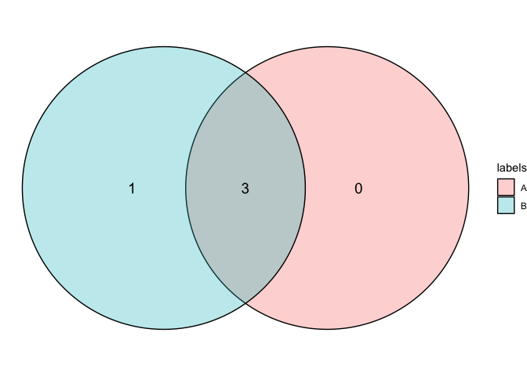
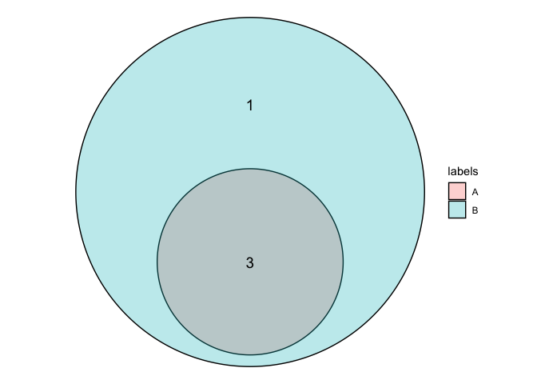

ggvenn
======

`ggvenn` extends the functionality of `ggplot`, enabling the creation of
Venn and Euler diagrams from two data frames.

Installation
------------

You can install the released version of ggvenn with:

    devtools::install_github("theottlo/ggvenn")

Example
-------

First, load the library! To demonstrate the use of the `plot_venn`
function, I’ve generated some sample data.

    library(ggvenn)

    # Generate sample data
    dfA <- data.frame(movie=c("Finding Nemo", "Shrek", "Toy Story"), rating=c(5, 3, 7))
    dfB <- data.frame(movie=c("Finding Nemo", "Shrek", "Toy Story", "Inception"), rating=c(5, 3, 7, 8))

Given two data frames, by default, `plot_venn` will create a Venn
diagram:

    # Plot Venn diagram
    plot_venn(dfA, dfB)
    #> Joining, by = c("movie", "rating")
    #> Joining, by = c("movie", "rating")

To create a Euler diagram, just set `euler=TRUE`:

    # Plot Euler diagram
    plot_venn(dfA, dfB, euler=TRUE)
    #> Joining, by = c("movie", "rating")
    #> Joining, by = c("movie", "rating")

Package Development
-------------------

Package development was done locally on RStudio using the `devtools`
package. Specifically, the package was created by running:

    library(devtools)
    create_package("path-to-package/ggvenn")

This yielded the following files/directories:

-   `DESCRIPTION` file
-   `NAMESPACE` file
-   `R` directory

**Documentation**

The `DESCRIPTION` file was manually edited to reflect some of the
package details such as the title, author, and description. To ensure
package dependencies are imported, `use_package()` was used, which
updated the `Imports` field in the `DESCRIPTION` accordingly. Further, a
license was added by running \`use\_mit\_license(“name”).

A `README.Rmd` was initialized using `use_readme_rmd()` and edited to
include a brief description of the package as well as the package
development process. This was then knit to yield a `README.md`.

I included some information on Venn/Euler diagrams and went over the
basic usage in a vignette found in the `vignettes` directory
(`vignettes/plotting-venn-euler-diagrams.Rmd`). This done with
`use_vignette()`.

**Functions**

Within the `R` directory, I created an R script for each function in
this package (i.e. each R script contains the code for each function).
As of `v0.1.0`, this package consists of a single function so there’s
only one R script: `R/plot_venn.R`. To properly document the function, I
inserted a Roxygen Skeleton for each function (`Code` &gt;
`Insert Roxygen Skeleton`) and edited the fields accordingly.

All tests can be found in the `test` directory, created by running
`use_testthat()`. Each test is written in an R script which was
initialized by running `use_test()`.
